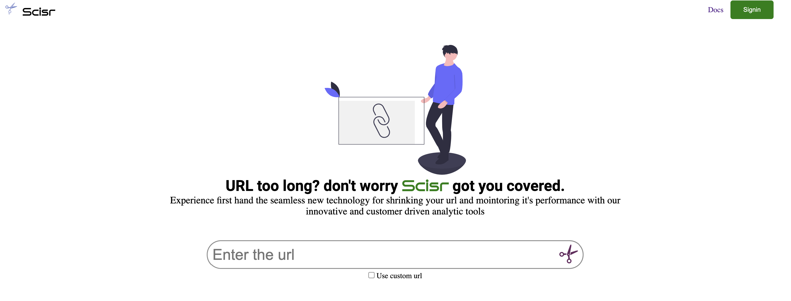
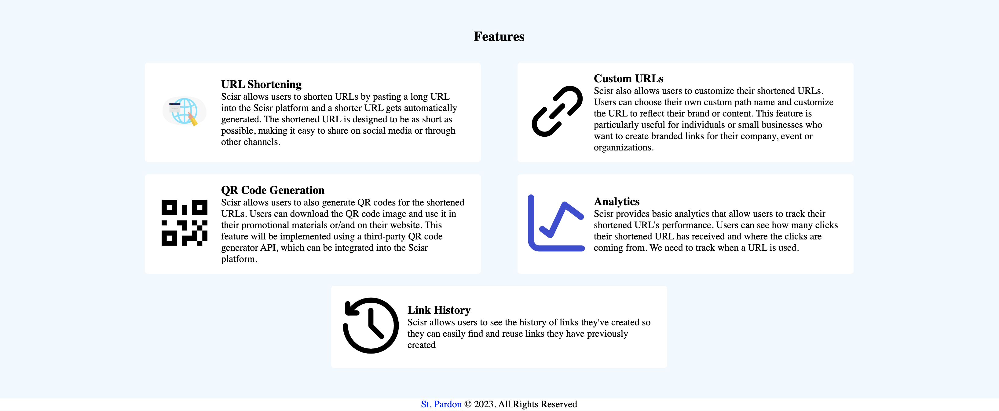
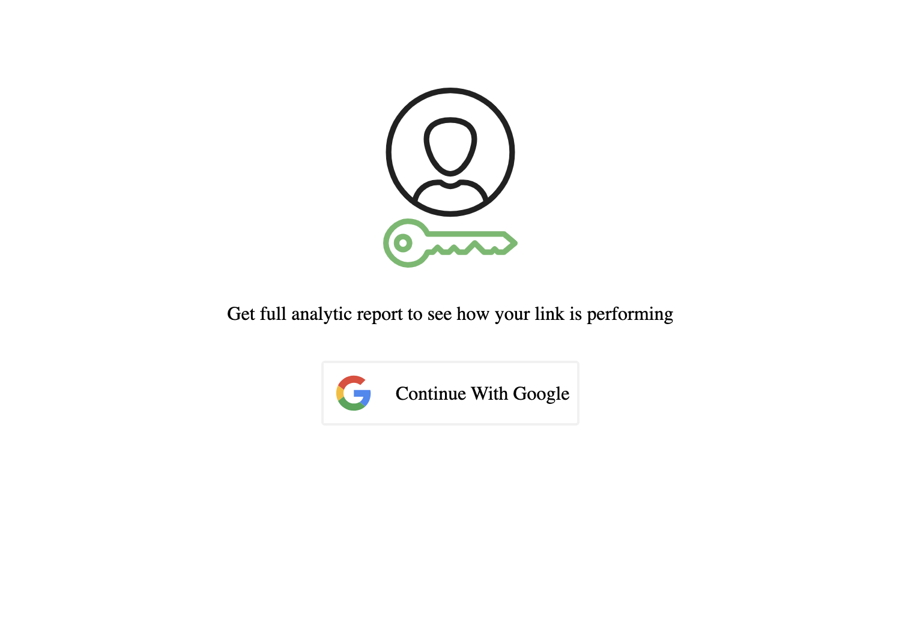

# Scisr

[](https://github.com/St-Pardon/scisr/commit)
[](https://github.com/St-Pardon/scisr/commit)
[](https://github.com/St-Pardon/scisr/license)

Brief is the new black, this is what inspires the team at Scisr. In today’s world, it’s important to keep things as short as possible, and this applies to more concepts than you may realize. From music, speeches, to wedding receptions, brief is the new black. Scisr is a simple tool which makes URLs as short as possible. Scisr thinks it can disrupt the URL shortening industry and give the likes of bit.ly and ow.ly a run for their money within 2 years.

## Content
- [Prerequisite](#prerequisite)
- [Getting Started](#getting-started)
- [Features](#features)
## Prerequisite
- Text Editor/IDE
- CLI/Termial
- Node Runtime
- Web Browser

## Getting Started
To get started, follow the instructions below.

### Prerequisites

To run this project, the following tools must be installed on your machine:

- IDE/Text Editor: preferrably [VSCode](https://code.visualstudio.com/) but any other will surfice.
- Git: if not already installed, install from [here](https://git-scm.com/downloads)
- Terminal: for windows users, [Git Bash](https://git-scm.com/downloads) or [WSL](https://learn.microsoft.com/en-us/windows/wsl/install) will do. Mac or Linux will users any terminal will do.
- API Platform: Application, extention or web base API Platform will do. check out [Postman](https://www.postman.com/) and [ThunderClient](https://www.thunderclient.com/)
- MongoDb: if not already installed, install from [here](https://www.mongodb.com/) or connect to [MongoDb Atlas](https://www.mongodb.com/cloud/atlas/register)
- Web Browser
- Redis-Server - if not already installed, install from [here](https://redis.io/)

### Set Up

**`Step 1:`** Open your terminal on your computer and clone the code [repository](https://github.com/St-Pardon/scisr.git).

```git
git clone https://github.com/St-Pardon/scisr.git
```
**`Step 2:`** Change into the cloned respository and list the content to make sure the content are intact.
```sh
cd scisr/
ls
...
```
**`Step 3:`** Install all dependencies from the [package.json](./package.json) file.
```sh
npm install
```
> This will install all packages needed for the application in the project directory, not globally.

**`Step 4:`** Start up your Mongo database service and Setup your environmental variables by creating a `.env` file and inputing the neccessary variable.
```sh
touch .env
```
Open the `.env` file on you text editor and create the variables using the this [sampledotenv](./sampledotenv)

**`Step 5:`** Start your redis server
```bash
redis-server
...
```
or
```bash
redis-server &
```
to start the redis server behind the scene


**`Step 6:`** Start the application
```bash
npm run start:dev
...
```

**`Step 7:`** Congratulation you have successfully started the application and now open your API Platform and test out the end points. To carefully expore and understand the endpoints see [API Documentation](#api-documentation) to get a list and demo of all the available endpoints and how to use them.

### Previews
- Homepage

- Feaures

- Signin

## Features
- **URL Shortening:**
Scisr allows users to shorten URLs by pasting a long URL into the Scisr platform and a shorter URL gets automatically generated. The shortened URL is designed to be as short as possible, making it easy to share on social media or through other channels.
- **Custom URLs:**
Scisr also allows users to customize their shortened URLs. Users can choose their own custom path name and customize the URL to reflect their brand or content. This feature is particularly useful for individuals or small businesses who want to create branded links for their 
- **QR Code Generation:**
Scisr allows users to also generate QR codes for the shortened URLs. Users can download the QR code image and use it in their promotional materials or/and on their website. This feature will be implemented using a third-party QR code generator API, which can be integrated into the Scisr platform.
- **Analytics:**
Scisr provides basic analytics that allow users to track their shortened URL's performance. Users can see how many clicks their shortened URL has received and where the clicks are coming from. We need to track when a URL is used.
- **Link History:**
Scisr allows users to see the history of links they’ve created so they can easily find and reuse links they have previously created

## API Documentations
The API Documentation is live with [Postman](https://documenter.getpostman.com/view/18352130/2s93sjUUX7) which contain the full list of the endpoints, their methods and some examples.

## Deployment
The demo of this project is live at [scisr](https://scr-t99f.onrender.com). Enjoy 🚀 🚀 🚀 

## Author(s)
The people resonsible for bring this to live includes
<br/>
<a href = "https://github.com/Tanu-N-Prabhu/Python/graphs/contributors">
  
</a>


## Contributions
There are two (2) ways you can contribute to this projects, contributing through the Codebase, or buy coffee for the maintainers of this project. If you wish to contribute to codebase of this project, read the following [rules and gudieline](./Contribution.md) to get started. Else you can [buy us a coffee](https://www.buymeacoffee.com/pardonne) <br />

## License
Project source code is licensed under the [MIT](./LICENSE) license. You are free to fork this repository, edit the code, share and use it both for non-commercial and commercial purposes